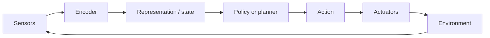

# Perception-Action Loop

## Context and Plain-Language Explanation

An embodied agent repeats a loop: observe, update internal state, choose an action, act, and observe the new consequence. Every step in the loop changes the world the next observation comes from — the agent is not predicting a fixed, external sequence, it is shaping the sequence it will see next.

## Why This Architecture Exists

In practical terms, **Perception-Action Loop** is useful because it addresses a limitation that simpler approaches face. The next paragraph explains that limitation in technical detail; first, keep in mind the real-world goal: making the model more useful, efficient, reliable, or capable for a particular kind of task.

Offline prediction (predict the next frame of a fixed video, translate a fixed sentence) treats the input stream as something the model has no effect on. An embodied agent's actions change the environment, which changes future observations. Any architecture that treats the observation stream as independent of its own outputs will fail to model this properly — it needs an explicit closed loop.

## Core Architectural Idea

The concrete data flow at each control step: sensors produce raw readings (camera image, joint encoders, force sensors). An encoder maps raw readings into a representation. A policy or planner (possibly using a world model, see [world-models-for-robotics.md](world-models-for-robotics.md)) maps that representation to an action. The action is sent to actuators, which changes the physical environment. The environment produces a new sensor reading, and the loop repeats.

```
sensors → encoder → representation → policy/planner → action → actuators → environment → new sensor reading → (repeat)
```

The loop closes at "new sensor reading" feeding back into "encoder" — this feedback is what lets the agent correct for prediction error, disturbances, or an imperfect first action, rather than executing a fixed pre-planned sequence blind.

## Information Flow



## Components

| Component | Role |
|---|---|
| Sensors | Produce raw observations: images, joint positions, forces, etc. |
| Encoder | Maps raw sensor data into a representation usable by the policy |
| Policy / planner | Maps representation (and optionally predicted futures) to an action |
| Actuators | Execute the chosen action, physically changing the environment |
| Feedback path | New sensor readings after the action re-enter the loop, closing it |

## Computational Characteristics

| Dimension | Notes |
|---|---|
| training parallelism | Training a policy from logged trajectories can be parallel (imitation learning); training via live interaction (RL) is inherently sequential per episode |
| sequence scaling | Real-time control imposes a hard wall-clock budget per loop iteration, independent of model size |
| total parameters | Determined by the encoder and policy/planner architecture used inside the loop |
| active parameters | Encoder and policy run once per control step; a planner using rollouts (see [planning-with-world-models.md](../09-predictive-and-world-models/planning-with-world-models.md)) runs the world model multiple times per step |
| persistent inference state | Whatever internal state the policy or world model carries across steps (e.g. a recurrent state, or the current world-model latent) |
| communication | Sensor-to-compute and compute-to-actuator latency are first-class constraints, unlike most other architectures in this repository |

## Strengths

- Explicitly captures feedback and intervention — the agent can correct course based on what its own previous action actually caused.
- Supports replanning at every step rather than committing to one fixed plan.
- Generalizes across very different embodiments as long as the loop's four stages are each implemented appropriately.

## Limitations and Failure Modes

- Physical errors can be irreversible — dropping an object, colliding with something — unlike a language model's mistake, which can simply be re-generated.
- Latency and safety requirements are strict: a control loop running too slowly can be unsafe or unstable regardless of how accurate its predictions are.
- Distribution shift is constant by construction: every action changes the state distribution the next observation is drawn from, which is different from the fixed-distribution assumption behind most offline training.

## Architecture vs Training Objective

The loop structure itself (sense, encode, decide, act, re-sense) is architecture. Whether the policy inside that loop is trained by imitation, reinforcement learning, or model-based planning is a training-objective choice, and can be swapped without changing the loop's structure.

## When to Use It

This structure is close to mandatory for any physical agent — it is the minimal architecture for a system whose actions affect its own future inputs.

## When Not to Use It

Not applicable — even simple reactive agents implement this loop, if only in a degenerate one-step form. The design choice is how much internal modeling (a world model, memory) sits inside the loop, not whether the loop exists.

## Comparison with Alternatives

A world model (see [what-is-a-world-model.md](../09-predictive-and-world-models/what-is-a-world-model.md)) predicts transitions inside this loop, letting the policy evaluate candidate actions before committing. A VLA model (see [vision-language-action-models.md](vision-language-action-models.md)) instead maps observations and instructions directly to actions without an explicit predictive step in between.

## Representative Models

Classical robotics control loops; any embodied RL or imitation-learning system; VLA and world-model-based robot policies as specific implementations of the loop's decision stage.

## References

- Brohan, A. et al. (2023). *RT-2: Vision-Language-Action Models Transfer Web Knowledge to Robotic Control.* [arXiv:2307.15818](https://arxiv.org/abs/2307.15818).

[Back to index](../INDEX.md)
