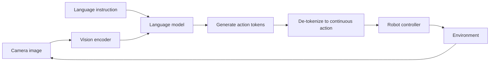

# Vision-Language-Action (VLA) Models

## One-Minute Explanation

A VLA model is a vision-language model fine-tuned to output robot actions as tokens, in the same vocabulary and format as text. This lets web-scale vision-language pretraining transfer directly into action prediction, instead of training a control policy from scratch.

## Problem It Tries to Solve

A robot needs to connect a semantic task description ("pick up the red block") to raw perception and low-level motor control. Training that connection purely from robot demonstration data is data-hungry, because robot data is orders of magnitude scarcer than web-scale image-text data. VLA models solve this by reusing a pretrained vision-language model's existing semantic knowledge and only adding action prediction on top.

## Core Architectural Idea

Take a pretrained vision-language model (image + text in, text out). Discretize the robot's continuous action space into bins, and represent each bin as an extra token in the model's existing vocabulary (see [action-tokenization-and-policy-models.md](action-tokenization-and-policy-models.md) for the discretization mechanism). Fine-tune the model so that, given an image observation and a language instruction, it generates a sequence of action tokens instead of (or in addition to) natural-language text — the model architecture itself does not change; only the output vocabulary's interpretation does.

Because action tokens reuse the model's existing token-generation machinery, all of the model's pretrained visual and language understanding (object recognition, spatial relations, instruction following) transfers into the action-prediction task with only a comparatively small amount of robot-specific fine-tuning data.

## Information Flow

## Components

| Component | Role |
|---|---|
| Vision encoder | Encodes the current camera observation(s) |
| Language model backbone | Fuses visual and language input, generates output tokens autoregressively |
| Action tokenizer | Maps continuous robot actions to/from discrete tokens in the model's vocabulary |
| Robot controller | Converts de-tokenized actions into low-level motor commands at control frequency |

## Computational Characteristics

| Dimension | Notes |
|---|---|
| training parallelism | Fine-tuning is standard autoregressive training, parallel over sequence positions like any language model |
| sequence scaling | Cost scales with number of action tokens generated per control step (often small, e.g. 7-8 tokens for a 7-DoF arm pose) |
| total parameters | Inherits the base VLM's parameter count, e.g. billions of parameters (RT-2 used models up to 55B) |
| active parameters | Full VLM backbone runs for every action-token generation step |
| persistent inference state | None beyond the current KV cache for the current instruction/observation context |
| communication | Standard model-parallel serving for a large VLM; on-robot inference often requires a smaller distilled or quantized variant to meet control-loop latency |

## Strengths

- Transfers general visual and semantic knowledge from web-scale pretraining into robot control, reducing the amount of robot-specific data required.
- Reuses existing sequence-generation infrastructure — no new decoder architecture needed for actions.
- Naturally supports multi-task and instruction-following behavior, since the language interface for tasks is already built into the base model.

## Limitations and Failure Modes

- Action precision and control frequency are constrained by autoregressive token generation, which is far slower than a dedicated low-latency control loop.
- Requires embodiment-specific calibration — action tokens trained for one robot's action space and camera setup do not transfer directly to a different robot.
- Safety is central: a language model generating action tokens has no built-in guarantee that a decoded action is physically safe or feasible.

## Architecture vs Training Objective

The vision-language backbone architecture is typically unchanged from a general-purpose VLM. What is new is the training objective and data: fine-tuning on (image, instruction, action) trajectories so the model learns to generate action tokens instead of, or alongside, natural-language text.

## When to Use It

Use a VLA model when a robot needs to follow varied natural-language instructions across many tasks, and some amount of pretrained visual-language knowledge should transfer into control with limited robot-specific data.

## When Not to Use It

Avoid a VLA model when control frequency requirements are too tight for autoregressive token generation, or when the task is narrow and fixed enough that a dedicated, smaller control policy trained purely on demonstration data would be simpler and faster.

## Comparison with Alternatives

A direct VLA policy predicts actions in a single forward pass without explicit lookahead. Pairing a VLA with an explicit world model (see [world-models-for-robotics.md](world-models-for-robotics.md)) adds predictive planning on top, at the cost of extra inference for rollouts.

## Representative Models

RT-2 (2023), RT-2-X, and successor VLA systems built on general-purpose vision-language backbones.

## References

- Brohan, A. et al. (2023). *RT-2: Vision-Language-Action Models Transfer Web Knowledge to Robotic Control.* [arXiv:2307.15818](https://arxiv.org/abs/2307.15818).

[Back to index](../INDEX.md)
