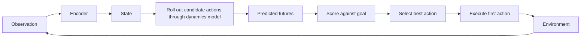

# World Models for Robotics

## One-Minute Explanation

A robotic world model predicts future states under candidate actions, so a planner can compare outcomes and choose controls with better expected results instead of acting on a fixed policy alone.

## Problem It Tries to Solve

A policy trained purely by imitation copies demonstrated behavior. In states far from any demonstration, it has little guidance for what to do — imitation gives no mechanism for the policy to reason about consequences it has never seen demonstrated. A world model gives the agent a way to evaluate "what happens if" even in states outside the demonstration distribution, as long as the model's dynamics generalize there.

## Core Architectural Idea

The concrete flow: encode the current observation into a state representation. Roll out candidate action-conditioned futures through the learned dynamics model (see [what-is-a-world-model.md](../09-predictive-and-world-models/what-is-a-world-model.md) and [planning-with-world-models.md](../09-predictive-and-world-models/planning-with-world-models.md) for the general mechanism). Score each predicted future against a goal. Execute the first action of the best-scoring sequence, then re-observe and replan — the model-predictive control loop.

For robotics specifically, the dynamics model has to represent physical contact and manipulation dynamics, which are harder to model than, say, passive video prediction of a static scene: contact introduces sharp, discontinuous changes in state (an object was free, now it is grasped) that a smooth learned dynamics function can struggle to capture precisely.

## Information Flow

## Components

| Component | Role |
|---|---|
| Encoder | Maps robot sensor observations to a state representation |
| Action-conditioned dynamics model | Predicts next state given current state and candidate action |
| Scoring function | Compares predicted futures against a goal state or reward |
| Replanning loop | Executes one action, re-observes, and plans again from the new real state |

## Computational Characteristics

| Dimension | Notes |
|---|---|
| training parallelism | Dynamics model trains in parallel over batches of (state, action, next state) transitions |
| sequence scaling | Planning cost scales with (candidates) × (horizon) dynamics-model calls per control step, same pattern as general world-model planning |
| total parameters | Dynamics model size varies from small MLPs over low-dimensional state to large video-encoder-based models (e.g. V-JEPA 2 scale) |
| active parameters | Encoder runs once per new observation; dynamics model runs once per predicted step per candidate |
| persistent inference state | Current state representation, carried across control steps |
| communication | Planning-time rollouts are typically single-node; real-time control latency budgets constrain how many candidates/horizon steps are feasible |

## Strengths

- Enables counterfactual planning: comparing predicted outcomes of different actions before committing to one.
- Can leverage large amounts of passive visual data for pretraining the encoder and dynamics model (see [v-jepa-2.md](../09-predictive-and-world-models/v-jepa-2.md)), reducing reliance on labeled robot interaction data alone.
- Generalizes across goals: one trained dynamics model can be reused with different scoring functions for different tasks.

## Limitations and Failure Modes

- Contact and manipulation dynamics — grasping, collisions, deformable objects — are hard to model accurately, since they involve sharp discontinuities a smooth learned function struggles to fit.
- Planning must fit inside the robot's control-loop latency budget; a dynamics model too slow to query enough candidates within that budget cannot be used for real-time control.
- Long-horizon rollouts compound prediction error, same as any world-model planning setup.

## Architecture vs Training Objective

The encoder/dynamics-model/scoring structure is architecture, shared with general world models. What differs specifically for robotics is the training data (robot interaction transitions, often much scarcer than passive video) and, sometimes, an action-conditioning objective added on top of a passively pretrained encoder.

## When to Use It

Use a robotic world model when a task requires generalizing to states or goals not covered by demonstration data, and control-loop latency budgets allow for planning-time rollouts.

## When Not to Use It

Avoid it when demonstration coverage is already good enough for a direct imitation policy to perform reliably, or when control latency is too tight for any rollout-based planning.

## Comparison with Alternatives

V-JEPA 2 (see [v-jepa-2.md](../09-predictive-and-world-models/v-jepa-2.md)) is a latent-predictive example that plans by comparing state embeddings directly. A generative simulator instead renders explicit predicted frames, trading extra rendering cost for direct visual inspectability of predicted outcomes.

## Representative Models

V-JEPA 2 applied to robot manipulation; Dreamer-style world models adapted to robotics; visual foresight / video-prediction-based planners.

## References

- Assran, M. et al. (2025). *V-JEPA 2: Self-Supervised Video Models Enable Understanding, Prediction and Planning.* [arXiv:2506.09985](https://arxiv.org/abs/2506.09985).

[Back to index](../INDEX.md)
