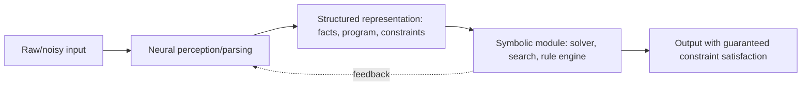

# Neuro-Symbolic Architectures

## Context and Plain-Language Explanation

Neuro-symbolic systems pair a neural component (good at perception, approximation, and pattern matching over noisy input) with a symbolic component (good at exact rule application, constraint satisfaction, or search). Neither replaces the other; each handles the part of the problem it's structurally suited for.

## Why This Architecture Exists

In practical terms, **Neuro-Symbolic Architectures** is useful because it addresses a limitation that simpler approaches face. The next paragraph explains that limitation in technical detail; first, keep in mind the real-world goal: making the model more useful, efficient, reliable, or capable for a particular kind of task.

Neural networks approximate functions well from data but don't guarantee that hard constraints are satisfied — a neural planner can produce an output that violates a rule it was never forced to respect. Symbolic systems (logic solvers, constraint solvers, formal grammars) enforce exact constraints but can't directly process raw, noisy perceptual input like images or natural language. Combining them lets perception feed a symbolic module that then guarantees the constraints the neural part alone couldn't.

## Core Architectural Idea

A neural component maps raw or noisy input into a structured representation — a set of facts, a program, or parameters for a symbolic query. A symbolic module (a theorem prover, constraint solver, search procedure, or fixed rule set) then operates on that structured representation to produce an output, enforcing whatever exactness the symbolic formalism guarantees. Some designs run this once (neural perception, then symbolic reasoning); others loop, using the symbolic module's output (e.g. a detected constraint violation) as feedback that reshapes the neural component's next attempt.

The interface between the two components — how a continuous neural output becomes a discrete symbolic input, and vice versa — is the central design problem. A discrete decision (e.g. "is this fact true") made from a continuous neural score requires a thresholding or sampling step that is not naturally differentiable, complicating end-to-end training across the boundary.

## Information Flow

## Components

| Component | Role |
|---|---|
| Neural perception/parsing module | Converts raw or noisy input into a structured, symbolic-compatible representation |
| Symbolic module | Solver, search procedure, or rule engine operating exactly on the structured representation |
| Neural-symbolic interface | The (often non-differentiable) boundary converting continuous scores into discrete symbolic inputs and back |
| Feedback loop (optional) | Uses symbolic-module output (e.g. a violated constraint) to reshape the neural component's next attempt |

## Computational Characteristics

| Dimension | Notes |
|---|---|
| training parallelism | The neural component trains with standard gradient-based methods; the symbolic component typically does not, so end-to-end training across the interface is often approximate (e.g. via reinforcement learning signals, or by only training the neural side against fixed symbolic feedback) |
| sequence scaling | Depends entirely on the chosen neural backbone; the symbolic module's own cost depends on the search or solving problem's complexity, independent of sequence length |
| total parameters | Neural component's parameter count; the symbolic module typically has no learned parameters of its own |
| active parameters | Same as the neural component's active parameters; the symbolic module runs in full each time it's invoked |
| persistent inference state | Depends on the neural backbone; the symbolic module may maintain search state (e.g. a partial proof or search tree) during its own operation |
| communication | Standard for the neural component; the interface itself is a serialization/deserialization step between continuous and discrete representations, not a distributed-systems communication pattern |

## Strengths

Exact constraint handling that a purely neural approach cannot guarantee by construction. Intermediate structured representations (facts, programs) can be more interpretable than a purely neural model's internal activations. A good structural fit for tasks that genuinely combine perception (neural strength) with formal reasoning or exact search (symbolic strength).

## Limitations and Failure Modes

The continuous-to-discrete interface is brittle — small perceptual errors in the neural component can produce a structured representation the symbolic module handles in a discontinuous, hard-to-predict way. End-to-end training across the neural-symbolic boundary is difficult precisely because the symbolic module is usually not differentiable, forcing approximate training strategies.

## Architecture vs Training Objective

The split into a neural component and a symbolic module, and the interface between them, is architecture. How well the neural component learns to produce symbolic-module-compatible representations depends heavily on the training signal used across that interface, which is often indirect (e.g. a downstream task reward) rather than a direct supervised label for the interface itself.

## When to Use It

Tasks that combine noisy perceptual input with a genuine need for exact rule satisfaction or formal search — e.g. parsing natural language into a query against a rule-governed knowledge base, or converting perception into constraints for a planner that must respect hard physical or logical limits.

## When Not to Use It

Tasks where approximate, learned behavior is acceptable throughout and no hard exactness guarantee is actually required — the added interface complexity buys nothing there. Tool-using LLM systems that call external calculators, code interpreters, or solvers are a related pattern at the system level, but calling an external tool does not make the tool part of the model's own architecture in the way a genuinely integrated symbolic module is.

## Comparison with Alternatives

A purely neural system is simpler to train end-to-end but offers no exactness guarantee. A purely symbolic system offers exactness but cannot directly process noisy perceptual input at all. Tool-augmented LLM systems achieve some of the same practical benefit (offloading exact computation to a reliable external component) without the tighter architectural integration and differentiability challenges of a true neuro-symbolic design.

## Representative Models

Neuro-symbolic designs vary widely by domain (program synthesis, visual question answering with explicit scene graphs, formal theorem proving assisted by learned heuristics) and are generally domain-specific research systems rather than a single standardized architecture family.

## References

No single primary paper defines "neuro-symbolic architecture" as a general category; it names a design pattern applied across many domain-specific systems (program synthesis, visual question answering, formal theorem proving). This page intentionally cites no primary source rather than attaching an unverified or non-representative one.

[Back to index](../INDEX.md)
