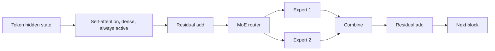

# Transformer + MoE

## Context and Plain-Language Explanation

A Transformer-MoE keeps the standard self-attention sublayer for token-to-token interaction, and replaces some or all of the dense feed-forward sublayers with routed MoE layers (see [05-sparse-and-mixture-of-experts/mixture-of-experts.md](../05-sparse-and-mixture-of-experts/mixture-of-experts.md)). Attention still owns "which tokens talk to which"; MoE owns "how much capacity is applied to transform each token."

## Why This Architecture Exists

In practical terms, **Transformer + MoE** is useful because it addresses a limitation that simpler approaches face. The next paragraph explains that limitation in technical detail; first, keep in mind the real-world goal: making the model more useful, efficient, reliable, or capable for a particular kind of task.

A fully dense Transformer's feed-forward capacity scales in lockstep with its per-token compute. If you want more total capacity than a given compute budget for attention and dense FFN allows, routing lets you add feed-forward capacity that isn't fully active on every token.

## Core Architectural Idea

Each Transformer block runs self-attention unchanged. The feed-forward sublayer, instead of being one dense FFN, becomes a router plus N expert FFNs, exactly as described in [mixture-of-experts.md](../05-sparse-and-mixture-of-experts/mixture-of-experts.md): `G(x) = softmax(top_k(x·W_g))`, k experts run per token, outputs combine into the residual stream. Which blocks get this treatment is itself a design choice — some Transformer-MoE architectures route every FFN layer, others alternate dense and MoE FFN layers through the depth of the network, keeping some layers fully dense for stability or capacity reasons.

**Concrete example — Mixtral 8x7B.** Every layer keeps standard multi-head attention (dense, always fully active). Every layer's feed-forward sublayer is replaced by 8 experts with top-2 routing. Total parameters are approximately 47B; active parameters per token are approximately 13B, because attention and 2 of the 8 experts per layer are active, while the other 6 experts per layer are not. This matches the FLOPs-per-token calculation in [05-sparse-and-mixture-of-experts/dense-vs-sparse-computation.md](../05-sparse-and-mixture-of-experts/dense-vs-sparse-computation.md): roughly 3.6× fewer FLOPs per token than a fully dense 47B model, for the same total capacity.

## Information Flow

## Components

| Component | Role |
|---|---|
| Self-attention sublayer | Unchanged from a dense Transformer; handles token-to-token interaction, always fully active |
| MoE feed-forward sublayer | Router plus N expert FFNs replacing the dense FFN; see [mixture-of-experts.md](../05-sparse-and-mixture-of-experts/mixture-of-experts.md) for the gating formula |
| Dense/MoE layer schedule | Which layers use MoE FFN vs. a plain dense FFN — a design choice affecting stability and capacity distribution through depth |

## Computational Characteristics

| Dimension | Notes |
|---|---|
| training parallelism | Combines standard Transformer parallelism (data/tensor/pipeline) with expert parallelism for the MoE sublayers |
| sequence scaling | Set by attention, O(n²) as in any Transformer; MoE routing doesn't change this axis |
| total parameters | Attention + embeddings (dense) + N × expert-FFN parameters — dominated by the expert count at typical N |
| active parameters | Attention + embeddings + k × expert-FFN parameters, independent of N (e.g. ~13B for Mixtral 8x7B out of ~47B total) |
| persistent inference state | Same KV cache as a dense Transformer of the same attention configuration; MoE adds no persistent state |
| communication | All-to-all dispatch/combine for the MoE sublayers, on top of standard Transformer communication |

## Strengths

Preserves the Transformer's proven token-interaction mechanism unchanged. Adds sparse capacity precisely where a dense FFN would otherwise bottleneck total model capacity against compute budget. Expert specialization can develop within the FFN's role without touching attention at all.

## Limitations and Failure Modes

All-to-all dispatch cost is added on top of the Transformer's existing compute, which matters most at small batch sizes (see [05-sparse-and-mixture-of-experts/moe-systems-tradeoffs.md](../05-sparse-and-mixture-of-experts/moe-systems-tradeoffs.md)). Total weight memory is large relative to active compute — serving infrastructure needs to hold every expert even though only k run per token. Routing imbalance (see [05-sparse-and-mixture-of-experts/load-balancing-and-specialization.md](../05-sparse-and-mixture-of-experts/load-balancing-and-specialization.md)) is a training-time risk inherited from the MoE component.

## Architecture vs Training Objective

Self-attention and the MoE router/expert structure are architecture. The load-balancing auxiliary loss, expert-parallel placement, and capacity factor are training/systems choices layered on top of that fixed structure — see the corresponding sections in the MoE pages this file cross-references.

## When to Use It

Large-scale pretraining where more total capacity is wanted without proportionally more compute per token, and where expert-parallel serving infrastructure is available — Mixtral 8x7B is the clearest public demonstration of this trade-off paying off.

## When Not to Use It

Small models or latency-critical low-batch serving, where MoE's dispatch overhead (see [05-sparse-and-mixture-of-experts/moe-systems-tradeoffs.md](../05-sparse-and-mixture-of-experts/moe-systems-tradeoffs.md)) is not amortized by enough concurrent tokens.

## Comparison with Alternatives

A fully dense Transformer at the same active-parameter count is operationally simpler but cannot match the total capacity of the MoE variant without matching its FLOPs per token. Transformer + SSM hybrids (see [transformer-plus-ssm.md](transformer-plus-ssm.md)) address a different bottleneck — sequence-length compute and inference memory — and are compatible with also adding MoE FFN layers, as some hybrid systems (e.g. Jamba) do.

## Representative Models

Mixtral 8x7B is the primary public reference for this pattern: dense attention, routed top-2 MoE feed-forward. Switch Transformer demonstrated MoE FFN routing at large scale in an earlier, non-hybrid Transformer-MoE design. Jamba combines Transformer, Mamba, and MoE FFN layers in one architecture (see [transformer-plus-ssm.md](transformer-plus-ssm.md)).

## References

- Jiang, A.Q. et al. (2024). *Mixtral of Experts.* [arXiv:2401.04088](https://arxiv.org/abs/2401.04088).
- Fedus, W. et al. (2021). *Switch Transformers: Scaling to Trillion Parameter Models with Simple and Efficient Sparsity.* [arXiv:2101.03961](https://arxiv.org/abs/2101.03961).
- Shazeer, N. et al. (2017). *Outrageously Large Neural Networks: The Sparsely-Gated Mixture-of-Experts Layer.* [arXiv:1701.06538](https://arxiv.org/abs/1701.06538).
- Lieber, O. et al. (2024). *Jamba: A Hybrid Transformer-Mamba Language Model.* [arXiv:2403.19887](https://arxiv.org/abs/2403.19887).

[Back to index](../INDEX.md)
