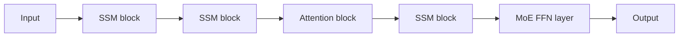

# Transformer + SSM

## Context and Plain-Language Explanation

A Transformer-SSM hybrid interleaves standard self-attention blocks with state-space or selective-SSM blocks (see [06-state-space-and-recurrent-alternatives/mamba.md](../06-state-space-and-recurrent-alternatives/mamba.md)) through the depth of the network. Attention layers provide explicit, addressable access to earlier tokens where that matters; SSM layers provide cheap, constant-size streaming state everywhere else.

## Why This Architecture Exists

In practical terms, **Transformer + SSM** is useful because it addresses a limitation that simpler approaches face. The next paragraph explains that limitation in technical detail; first, keep in mind the real-world goal: making the model more useful, efficient, reliable, or capable for a particular kind of task.

Pure attention gives exact addressability over the full context but costs O(n²) compute and a KV cache that grows with context length (see [06-state-space-and-recurrent-alternatives/transformer-vs-ssm-vs-recurrent.md](../06-state-space-and-recurrent-alternatives/transformer-vs-ssm-vs-recurrent.md)). Pure SSM gives O(n) compute and constant inference memory but compresses history into a fixed-size state, losing exact recall of arbitrary earlier content. A hybrid tries to get most of the memory savings of SSM while keeping enough attention layers to preserve exact recall where the model actually needs it.

## Core Architectural Idea

The network alternates or otherwise mixes two block types through its depth: standard Transformer blocks (self-attention + FFN) and SSM blocks (e.g. Mamba's selective state-space recurrence + FFN). The ratio and placement of the two block types is a design choice — some designs use a small number of attention layers spaced periodically through an otherwise SSM-dominated stack, keeping most of the sequence-length cost linear while retaining a few full-context lookup points.

**Concrete example — Jamba.** Jamba interleaves Transformer and Mamba layers, and adds MoE routing (see [transformer-plus-moe.md](transformer-plus-moe.md)) to some of the feed-forward sublayers to increase total capacity without proportionally increasing active compute. The result combines three separate architectural ideas in one stack: attention for addressable interaction at select layers, Mamba for cheap linear-time recurrence at most layers, and MoE for capacity that doesn't scale active compute — each mechanism assigned to the part of the problem it's best suited for, following the "which primitive should own which computation" framing in [why-hybrid-architectures.md](why-hybrid-architectures.md).

## Information Flow

## Components

| Component | Role |
|---|---|
| Attention blocks | Provide explicit, addressable interaction with earlier tokens, placed at select depths |
| SSM blocks | Provide linear-time, constant-state recurrence for most of the network's depth |
| Layer schedule | The specific ratio and placement of attention vs. SSM blocks; a tuned design choice, not a fixed rule |
| (Optional) MoE FFN layers | Add sparse capacity to some feed-forward sublayers, orthogonal to the attention/SSM axis (see [transformer-plus-moe.md](transformer-plus-moe.md)) |

## Computational Characteristics

| Dimension | Notes |
|---|---|
| training parallelism | Attention layers parallelize across the sequence as usual; SSM layers parallelize via a selective-scan or convolutional formulation — the two need separate, compatible kernel implementations |
| sequence scaling | Reduced relative to a pure-attention model — most layers scale O(n), only the attention layers retain O(n²) cost |
| total parameters | Sum of attention-layer, SSM-layer, and (if present) MoE-layer parameters |
| active parameters | Same as total unless MoE routing is also present, in which case active parameters are reduced by routing (see [transformer-plus-moe.md](transformer-plus-moe.md)) |
| persistent inference state | A KV cache sized only by the (fewer) attention layers, plus a constant-size SSM state per SSM layer — smaller than a pure-attention model's full-depth KV cache |
| communication | Standard Transformer communication for attention layers; standard SSM parallelism for SSM layers; all-to-all if MoE FFN layers are present |

## Strengths

Balances exact retrieval (from the attention layers) with cheap, linear-time recurrence (from the SSM layers). Reduces KV-cache memory pressure relative to a pure-attention model of the same depth, since only a subset of layers carry a growing cache. Layer-by-layer composition is flexible — the attention/SSM ratio can be tuned per use case.

## Limitations and Failure Modes

Two different kernel and state systems (attention's KV cache mechanics, SSM's selective-scan mechanics) must both be implemented and optimized well, roughly doubling the systems complexity compared to a single-mechanism model. The optimal ratio and placement of attention vs. SSM layers is task- and scale-dependent, without a single settled rule, so it typically requires empirical tuning per model family.

## Architecture vs Training Objective

The choice and placement of attention vs. SSM blocks is architecture, fixed at model design time. Data, optimization schedule, and post-training can still materially change observed behavior without changing this backbone structure, exactly as with any other architecture family.

## When to Use It

Long-context applications where a full-attention model's growing KV cache is the binding memory constraint, but some exact-retrieval capability over the context is still needed — a hybrid can reduce cache size substantially while retaining that capability at the attention layers.

## When Not to Use It

Short-context applications where a pure-attention model's KV cache was never a binding constraint to begin with — the added systems complexity of a hybrid buys little in that regime. Also not a good fit for tasks that need explicit, precise retrieval essentially everywhere in the sequence, where a pure-attention model's more thorough addressability is preferable to a hybrid's reduced attention-layer coverage.

## Comparison with Alternatives

Pure attention: better worst-case retrieval, worse long-context memory scaling. Pure SSM/Mamba: better long-context memory scaling, weaker exact-retrieval guarantees. The hybrid is explicitly a compromise on this axis rather than a strict improvement over either pure approach — see [06-state-space-and-recurrent-alternatives/transformer-vs-ssm-vs-recurrent.md](../06-state-space-and-recurrent-alternatives/transformer-vs-ssm-vs-recurrent.md) for the underlying trade-off this hybrid is navigating.

## Representative Models

Jamba is the primary public reference combining Transformer, Mamba, and MoE layers in one architecture.

## References

- Lieber, O. et al. (2024). *Jamba: A Hybrid Transformer-Mamba Language Model.* [arXiv:2403.19887](https://arxiv.org/abs/2403.19887).
- Gu, A. & Dao, T. (2023). *Mamba: Linear-Time Sequence Modeling with Selective State Spaces.* [arXiv:2312.00752](https://arxiv.org/abs/2312.00752).

[Back to index](../INDEX.md)
