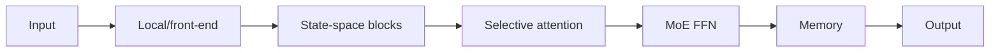

# Why Hybrid Architectures

No single mechanism dominates every constraint. Each primitive below wins on a specific axis and loses on others; a hybrid architecture is a bet that a given workload's constraints are better served by combining primitives than by picking one and using it everywhere.

- **Attention** gives explicit, content-addressable interaction between any two tokens, at O(n²) compute and a KV cache that grows with context (see [03-attention-and-transformers](../03-attention-and-transformers)).
- **SSM/recurrent state** gives compact, O(n), streaming context, at the cost of compressing history into a fixed-size state instead of keeping it explicitly addressable (see [06-state-space-and-recurrent-alternatives](../06-state-space-and-recurrent-alternatives/state-space-models-and-s4.md)).
- **MoE** gives conditional capacity — more total parameters without proportionally more active compute per token (see [05-sparse-and-mixture-of-experts/mixture-of-experts.md](../05-sparse-and-mixture-of-experts/mixture-of-experts.md)).
- **Convolution** gives efficient, cheap locality for inputs where nearby positions matter most.
- **Memory** gives persistence beyond a single local context window.
- **World models** give predictive rollouts — simulating forward before acting, rather than only reacting to observed input.

## A concrete instance: Jamba

Jamba (see [transformer-plus-ssm.md](transformer-plus-ssm.md)) interleaves attention layers, Mamba layers, and MoE feed-forward layers in one stack — attention for addressable retrieval at select layers, Mamba for cheap linear-time recurrence through most of the depth, MoE for capacity that doesn't scale active compute. Each mechanism is assigned to the part of the workload it's structurally best suited for, rather than one mechanism being stretched to cover every requirement.

## The design question

Adding a mechanism is only justified if it removes a real bottleneck the existing stack has. Before adding a new primitive to a design, name the specific bottleneck it removes (compute, memory, exact retrieval, capacity, persistence, or planning) and check that no existing component in the stack already handles it adequately. Composition without a clear ownership boundary — which mechanism is responsible for which computation — usually increases implementation and tuning complexity faster than it increases capability.

The recurring architecture question, across every hybrid design in this section, is: **which primitive should own which computation?**

## References

- Lieber, O. et al. (2024). *Jamba: A Hybrid Transformer-Mamba Language Model.* [arXiv:2403.19887](https://arxiv.org/abs/2403.19887).
- Gu, A. & Dao, T. (2023). *Mamba: Linear-Time Sequence Modeling with Selective State Spaces.* [arXiv:2312.00752](https://arxiv.org/abs/2312.00752).
- Fedus, W. et al. (2021). *Switch Transformers: Scaling to Trillion Parameter Models with Simple and Efficient Sparsity.* [arXiv:2101.03961](https://arxiv.org/abs/2101.03961).

[Back to index](../INDEX.md)
