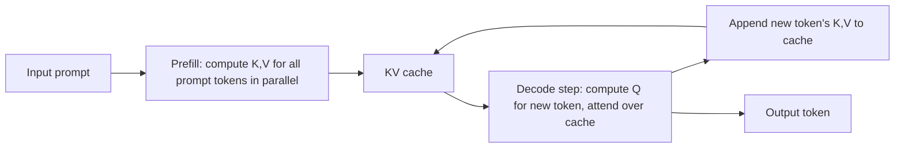

# KV Cache and Memory Bandwidth

## Context and Plain-Language Explanation

An autoregressive Transformer caches the key and value projections it computed for every past token, so generating the next token doesn't require recomputing the whole prefix. This cache grows with context length, and reading it back on every decode step is what usually limits decoding speed, not the arithmetic itself.

## Why This Architecture Exists

In practical terms, **KV Cache and Memory Bandwidth** is useful because it addresses a limitation that simpler approaches face. The next paragraph explains that limitation in technical detail; first, keep in mind the real-world goal: making the model more useful, efficient, reliable, or capable for a particular kind of task.

Without a cache, generating token n+1 would require rerunning attention over all n previous tokens from scratch, and generating token n+2 would rerun over n+1 tokens, and so on — the total work to generate a sequence of length n would scale roughly with n², even though each individual attention computation only needs each past token's key/value once. Caching those key/value tensors after they're computed avoids recomputing them.

## Core Architectural Idea

**Prefill** processes the entire input prompt in one parallel pass, computing and storing a key and value tensor for every token, every layer, every attention head. **Decode** then proceeds one new token at a time: compute that one token's query, attention-score it against every cached key (including the ones just added), read the corresponding cached values, append the new token's own key/value to the cache, and repeat.

The cache size for a standard multi-head Transformer is:

```
cache_bytes = 2 × layers × kv_heads × head_dim × seq_len × batch × bytes_per_element
```

The factor of 2 accounts for storing both keys and values. GQA/MQA (see [03-attention-and-transformers/mqa-gqa-and-kv-cache.md](../03-attention-and-transformers/mqa-gqa-and-kv-cache.md)) reduce kv_heads directly, shrinking this formula's dominant term without changing the number of query heads used for attention itself.

**Why decode is memory-bandwidth bound.** Arithmetic intensity is the ratio of FLOPs performed to bytes moved from memory. During decode, each step processes exactly one new token, so the matrix multiplies involved are matrix-vector products (the "batch dimension" for compute purposes is 1 token), not the much more FLOPs-dense matrix-matrix products used during prefill or training. But every decode step must still read the *entire* set of model weights, plus the *entire* KV cache accumulated so far, from memory. Reading a large amount of data to do a comparatively small amount of arithmetic per byte read is exactly the signature of a memory-bandwidth-bound (rather than compute-bound) workload.

**Worked arithmetic-intensity example.** Take a 7B-parameter dense model in fp16 (2 bytes/parameter): weight memory to read per decode step ≈ 7×10⁹ × 2 bytes = 14 GB. FLOPs per decode step (using the ≈2×N approximation for one token, see [compute-and-memory-cost-model.md](compute-and-memory-cost-model.md)) ≈ 2 × 7×10⁹ = 1.4×10¹⁰ FLOPs. Arithmetic intensity ≈ 1.4×10¹⁰ / 14×10⁹ ≈ **1 FLOP per byte**. Modern accelerators typically need on the order of 100+ FLOPs per byte moved to be compute-bound rather than bandwidth-bound (the exact crossover depends on the specific hardware's FLOPs-to-bandwidth ratio) — at roughly 1 FLOP/byte, single-token decode sits far on the bandwidth-bound side, meaning the achievable decode throughput is set by how fast weights (and the KV cache) can be streamed from memory, not by how fast the accelerator can multiply.

This is also why batching multiple decode requests together helps: with B concurrent sequences decoded together, the same weight-read cost is amortized across B tokens' worth of arithmetic, raising the effective FLOPs-per-byte ratio toward the compute-bound regime — though each sequence still needs its own KV cache read, so batching helps compute intensity but does not reduce total KV-cache memory traffic.

## Information Flow



## Components

| Component | Role |
|---|---|
| Prefill pass | Parallel computation of K/V for the full input prompt, populating the initial cache |
| KV cache | Stored key/value tensors per layer, per head, per past token; read on every subsequent decode step |
| Decode step | Sequential, one-token-at-a-time computation that reads the full cache and appends one new entry |
| GQA/MQA head reduction | Structural change reducing kv_heads, shrinking cache size (see [03-attention-and-transformers/mqa-gqa-and-kv-cache.md](../03-attention-and-transformers/mqa-gqa-and-kv-cache.md)) |

## Computational Characteristics

| Dimension | Notes |
|---|---|
| training parallelism | Not applicable in the same way — the KV cache is an inference-time mechanism; training processes full sequences in parallel without needing to cache anything across steps |
| sequence scaling | Cache size grows linearly with sequence length (seq_len term in the formula above); decode-step compute per token stays roughly constant, but memory traffic per step grows as the cache grows |
| total parameters | Unaffected — cache size is a function of architecture (layers, heads, head_dim) and context length, not total parameter count directly |
| active parameters | Every decode step reads the same active-parameter weights it would for any token |
| persistent inference state | The KV cache itself — this is the canonical example of "persistent inference state" referenced throughout this repository's Computational Characteristics tables |
| communication | In distributed serving, the KV cache must be visible to whichever device computes the next token's attention, which can require cache placement/sharding decisions across devices for very long contexts or large batches |

## Strengths

Practical, tractable autoregressive decoding — without caching, generation cost would grow quadratically with output length instead of linearly. Well-understood, mature serving pattern with broad tooling and kernel support.

## Limitations and Failure Modes

Cache size grows with context length, number of layers, batch size, and KV-head count simultaneously, and can dominate total memory usage at long context or high concurrency. Because decode is memory-bandwidth bound (see the worked example above), adding more compute (a faster accelerator's raw FLOPs) does not proportionally speed up decode if bandwidth is the actual constraint.

## Architecture vs Training Objective

The KV cache is a consequence of the attention architecture and the autoregressive decoding procedure, not of the training objective — a model trained differently but sharing the same attention structure would need the same cache at inference. GQA/MQA are architectural choices made at training time that determine the cache's size at inference time.

## When to Use It

Any autoregressive Transformer serving multiple tokens per request needs KV caching — it is close to a mandatory serving optimization rather than an optional one, given the quadratic-cost alternative.

## When Not to Use It

Not applicable as an optional choice for standard autoregressive Transformer serving. The real design choices are around it: how much to shrink the cache via GQA/MQA (see [03-attention-and-transformers/mqa-gqa-and-kv-cache.md](../03-attention-and-transformers/mqa-gqa-and-kv-cache.md)), and whether an SSM/recurrent architecture with a constant-size state (see [06-state-space-and-recurrent-alternatives/state-space-models-and-s4.md](../06-state-space-and-recurrent-alternatives/state-space-models-and-s4.md)) is a better fit for the context-length regime in question.

## Comparison with Alternatives

GQA and MQA reduce the number of distinct KV heads, shrinking the cache without eliminating the linear-growth-with-context problem. Recurrent/SSM models replace the growing cache entirely with a fixed-size state, at the cost of the compressed-history trade-off discussed in [06-state-space-and-recurrent-alternatives/transformer-vs-ssm-vs-recurrent.md](../06-state-space-and-recurrent-alternatives/transformer-vs-ssm-vs-recurrent.md).

## Representative Models

KV caching is near-universal practice across autoregressive Transformer serving stacks; GQA and MQA are the standard architectural mitigations for its memory growth.

## References

- Shazeer, N. (2019). *Fast Transformer Decoding: One Write-Head is All You Need.* [arXiv:1911.02150](https://arxiv.org/abs/1911.02150).
- Ainslie, J. et al. (2023). *GQA: Training Generalized Multi-Query Transformer Models from Multi-Head Checkpoints.* [arXiv:2305.13245](https://arxiv.org/abs/2305.13245).

[Back to index](../INDEX.md)
