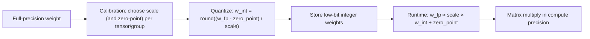

# Quantization and Architecture

## One-Minute Explanation

Quantization stores weights (and sometimes activations) using fewer bits per value than the fp16/bf16 or fp32 formats a model is normally trained in. Fewer bits per value means less memory to store the model and less memory bandwidth to move it during inference — directly addressing the bandwidth bottleneck described in [kv-cache-and-memory-bandwidth.md](kv-cache-and-memory-bandwidth.md).

## Problem It Tries to Solve

Large models are frequently limited by how much memory they occupy and how fast that memory can be read, not by raw compute availability. A model too large to fit in available device memory at full precision can't be served at all; a model that fits but requires reading many gigabytes of weights per decode step is bandwidth-bound regardless of accelerator FLOPs. Reducing bits per parameter addresses both problems directly.

## Core Architectural Idea

Each weight (originally a 16- or 32-bit floating point value) is mapped to a lower-precision representation — commonly INT8 (8 bits) or INT4 (4 bits) — using a scale factor (and sometimes a zero-point offset) computed per tensor or per smaller group of weights, so the reduced-precision integers can be converted back to an approximate floating-point value at compute time: `w_fp ≈ scale × w_int + zero_point`. GPTQ (Frantar et al.) is a widely used post-training quantization method that solves for these lower-precision weights layer by layer, correcting each layer's quantization error against the *remaining* full-precision weights before quantizing the next layer, which noticeably reduces the accuracy loss compared to quantizing every weight independently and ignoring how errors compound.

**Worked memory example — a 7B-parameter model.**

| Precision | Bytes per parameter | Total memory (7×10⁹ params) |
|---|---|---|
| fp16 | 2 | 7×10⁹ × 2 = 14 GB |
| INT8 | 1 | 7×10⁹ × 1 = 7 GB |
| INT4 | 0.5 | 7×10⁹ × 0.5 = 3.5 GB |

Moving from fp16 to INT4 cuts weight memory by 4×, from 14 GB to 3.5 GB. This directly reduces the per-decode-step memory traffic identified as the bottleneck in [kv-cache-and-memory-bandwidth.md](kv-cache-and-memory-bandwidth.md) — since decode reads the full weight set every step, a 4× smaller weight footprint means up to roughly 4× less bandwidth demand from weights alone (KV-cache bandwidth is a separate cost, reduced only if the cache itself is also quantized).

**The accuracy trade-off.** Compression is not free. Lower bit-widths give the quantization scheme less resolution to represent each weight's true value, and the resulting rounding error accumulates through the network's layers. INT8 quantization is now close to lossless for most models with a reasonable calibration procedure; INT4 typically shows a measurable but often small accuracy degradation depending on the model, the quantization method, and which layers are quantized; going below INT4 tends to produce larger, less predictable quality loss without more sophisticated techniques.

## Information Flow

## Components

| Component | Role |
|---|---|
| Scale / zero-point | Per-tensor or per-group parameters mapping between low-precision integers and approximate floating-point values |
| Calibration procedure | Determines scale/zero-point values, often using a small representative dataset to minimize quantization error |
| Layer-wise error correction (GPTQ-style) | Adjusts each layer's quantization to compensate for error already introduced by previously-quantized layers |
| Dequantization step | Converts stored low-bit weights back to a working floating-point value at compute time |

## Computational Characteristics

| Dimension | Notes |
|---|---|
| training parallelism | Not applicable in the post-training quantization case (GPTQ and similar); quantization is applied after training completes, though quantization-aware training is a separate, training-time alternative |
| sequence scaling | Unaffected by quantization directly; quantization changes memory footprint and bandwidth, not the sequence-length scaling of attention or recurrence |
| total parameters | Unchanged in count; only the bits used to represent each parameter change |
| active parameters | Same as total; quantization doesn't change which parameters are active, only how they're stored |
| persistent inference state | The KV cache can also be quantized (independently of weight quantization), which further reduces the bandwidth cost identified in [kv-cache-and-memory-bandwidth.md](kv-cache-and-memory-bandwidth.md) |
| communication | Reduced — smaller weight tensors mean less data to move in any distributed or memory-bandwidth-constrained serving setup |

## Strengths

Directly reduces memory footprint (see the worked 7B example) and, since decode is memory-bandwidth bound, can proportionally increase decode throughput. Enables serving models on hardware that couldn't hold them at full precision at all — the primary enabler for local and edge deployment (see [edge-ai-architecture.md](edge-ai-architecture.md)).

## Limitations and Failure Modes

Very low precision (below INT4, or naive INT4 without a careful calibration method) can measurably reduce model accuracy, especially for tasks sensitive to precise numerical outputs. Certain activation values ("outliers" — a small number of unusually large activations) are disproportionately hard to quantize accurately and can dominate quantization error if not handled specially (e.g. by keeping outlier channels at higher precision while quantizing the rest).

## Architecture vs Training Objective

Post-training quantization is applied after the training objective has already shaped the model's weights — it's a separate, later transformation of an already-trained model, not part of the original training procedure. Quantization-aware training, by contrast, incorporates simulated quantization effects into the training loop itself, which is a training-time choice rather than a purely post-hoc one.

## When to Use It

Whenever memory capacity or memory bandwidth is the binding constraint on serving a model — which, per [kv-cache-and-memory-bandwidth.md](kv-cache-and-memory-bandwidth.md), is the common case for autoregressive decode. Essentially always worth evaluating for production serving unless accuracy requirements are unusually strict.

## When Not to Use It

Tasks with very tight numerical accuracy requirements where even a small quantization-induced degradation is unacceptable, or where the model is already compute-bound rather than memory-bound (quantization's main benefit doesn't help a compute-bound workload as directly).

## Comparison with Alternatives

Distillation trains a genuinely smaller model to imitate a larger one, reducing both memory and active compute, but requires a training run; quantization compresses an existing model's memory footprint without changing parameter count or requiring full retraining. The two are complementary — a distilled model can also be quantized.

## Representative Models

GPTQ is a widely used post-training quantization method applicable across Transformer-based model families; per-tensor and per-group INT8/INT4 quantization schemes are broadly standard practice in production LLM serving.

## References

- Frantar, E. et al. (2023). *GPTQ: Accurate Post-Training Quantization for Generative Pre-trained Transformers.* [arXiv:2210.17323](https://arxiv.org/abs/2210.17323).

[Back to index](../INDEX.md)
