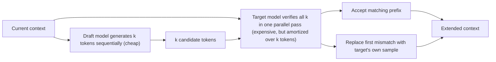

# Speculative Decoding

## Context and Plain-Language Explanation

A small, cheap draft model proposes several tokens ahead. The large target model then checks all of them in a single forward pass, instead of generating them one expensive step at a time. Correct guesses are accepted for free; the first wrong guess is discarded and the target model's own prediction is used instead.

## Why This Architecture Exists

In practical terms, **Speculative Decoding** is useful because it addresses a limitation that simpler approaches face. The next paragraph explains that limitation in technical detail; first, keep in mind the real-world goal: making the model more useful, efficient, reliable, or capable for a particular kind of task.

Ordinary autoregressive decoding needs one full forward pass through the (large, expensive) target model per generated token. Most of that per-token cost is spent reading model weights and the KV cache from memory (see [kv-cache-and-memory-bandwidth.md](kv-cache-and-memory-bandwidth.md)), and that memory-bandwidth cost doesn't scale down just because a token happens to be easy to predict. Speculative decoding tries to get several tokens verified for close to the price of one target-model pass.

## Core Architectural Idea

At each round: the draft model, which is much smaller and cheaper per token than the target, autoregressively generates k candidate tokens. The target model then runs one forward pass over the full draft sequence (all k tokens at once, since verifying is a parallel operation, unlike generating), producing its own next-token distribution at each of the k positions. Each drafted token is accepted if it's consistent with the target model's distribution at that position (in the exact formulation, accepted with a probability designed so the overall output distribution exactly matches sampling from the target model alone); the process stops at the first rejected token, and the target model's own sample replaces it. If all k drafted tokens are accepted, the target model additionally emits one bonus token for free from its own next-position distribution.

**Worked expected-speedup example.** Suppose each drafted token has an independent 70% chance of acceptance (p = 0.7), and the draft proposes k = 4 tokens per round. The expected number of accepted draft tokens per round, before hitting a rejection, is:

```
E[accepted] = p + p² + p³ + p⁴
            = 0.7 + 0.49 + 0.343 + 0.2401
            = 1.7731
```

(This is the expected length of a run of successes before the first failure, capped at k=4; each term p^i is the probability that at least i tokens in a row are accepted.) Adding the target model's own bonus token when all k are accepted contributes a small additional term (p⁴ × 1 = 0.2401), giving an expected total of about **2.01 tokens produced per target-model verification pass**, compared to exactly 1 token per pass under plain autoregressive decoding — roughly a 2× reduction in the number of expensive target-model passes needed, before accounting for the (much cheaper) cost of running the draft model k times per round.

Raising the acceptance probability increases the payoff substantially: at p = 0.9 with k = 4, E[accepted] = 0.9+0.81+0.729+0.6561 = 3.10, plus a bonus term of 0.6561, for roughly 3.75 tokens per verification pass — speculative decoding's benefit scales with how well the draft model approximates the target, not just with how many tokens it drafts.

## Information Flow



## Components

| Component | Role |
|---|---|
| Draft model | Small, cheap model proposing k candidate tokens autoregressively per round |
| Target model | The large model whose output distribution the whole procedure is designed to match exactly |
| Verification pass | Single parallel forward pass of the target model over all k drafted tokens |
| Acceptance/rejection rule | Determines how many drafted tokens are kept, calibrated so the final output distribution matches sampling from the target model alone |

## Computational Characteristics

| Dimension | Notes |
|---|---|
| training parallelism | Not applicable — this is a pure inference-time technique; both models are trained independently and normally beforehand |
| sequence scaling | Reduces the number of target-model forward passes needed per output token, but each pass still costs the same as a single target-model decode step over k positions |
| total parameters | Draft model parameters + target model parameters; the draft model adds parameters but they're small relative to the target |
| active parameters | Both models run in full when active; the draft model's small size is what keeps its k sequential steps cheap relative to one target-model pass |
| persistent inference state | Both models maintain their own KV caches; the target's cache must be updated to reflect whichever prefix was actually accepted, discarding cache entries for rejected draft positions |
| communication | No new cross-device communication pattern beyond what serving either model already requires |

## Strengths

Can substantially reduce the number of expensive target-model decode steps, as shown in the worked example above. In the exact (not just heuristic) formulation, output samples come from precisely the same distribution as plain target-model decoding — speed without a quality trade-off, when implemented per the exact acceptance rule.

## Limitations and Failure Modes

Speedup is entirely dependent on the acceptance rate: a draft model that rarely agrees with the target produces little or no benefit, since every rejection falls back to the cost of the target model's own single-token step for that position, plus the wasted draft compute. Adds real system complexity — two models, a verification and acceptance procedure, and cache management for partially-accepted draft sequences.

## Architecture vs Training Objective

Speculative decoding is an inference-time procedure, not a change to either model's architecture — the target model's forward pass and trained weights are unchanged from ordinary decoding. Draft-model quality (and thus achieved speedup) depends on how the draft model was trained and how closely it approximates the target model's distribution, which is a training-time concern separate from the decoding procedure itself.

## When to Use It

Any latency-sensitive autoregressive serving setup where a cheap, reasonably-aligned draft model is available (e.g. a smaller model from the same family, or a distilled version of the target) and where decode is memory-bandwidth bound (see [kv-cache-and-memory-bandwidth.md](kv-cache-and-memory-bandwidth.md)), which is the regime where amortizing weight/cache reads over multiple verified tokens pays off.

## When Not to Use It

When no reasonably well-aligned draft model exists — a poorly-matched draft produces low acceptance rates and can make throughput worse, not better, once its own compute cost is included. Also less beneficial in already-compute-bound settings (e.g. very large batch sizes), where the workload is no longer predominantly bandwidth-bound and there is less slack for verification to exploit.

## Comparison with Alternatives

Speculative decoding is an inference-time scheduling technique, not an alternative backbone architecture — it composes with any of the architectures described elsewhere in this repository (dense Transformer, MoE, SSM) as long as a suitable draft model exists for the target.

## Representative Models

The technique is model-agnostic; common practical setups pair a target model with a much smaller model from the same family, or a distilled variant of the target, as the draft.

## References

- Leviathan, Y., Kalman, M. & Matias, Y. (2023). *Fast Inference from Transformers via Speculative Decoding.* [arXiv:2211.17192](https://arxiv.org/abs/2211.17192).

[Back to index](../INDEX.md)
