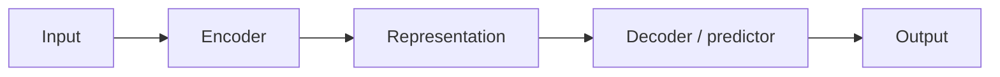

# Encoder and Decoder Pattern

An **encoder** maps input to a representation; a **decoder** maps a representation (and, in autoregressive settings, its own prior outputs) to output.

## What changes across instances of this pattern

The pattern is fixed; what varies is what the intermediate representation `Z` is required to preserve, and how the decoder is allowed to access it:

- **Seq2seq (RNN, pre-attention)**: `Z` is one fixed-size vector — the encoder's final hidden state. This is an information bottleneck for long inputs (see Encoder-Decoder and Sequence-to-Sequence).
- **Transformer encoder-decoder (T5, original Transformer)**: `Z` is one vector *per source position*, and the decoder reads all of them via cross-attention: `CrossAttn(Q=decoder, K=Z, V=Z)` — no single-vector bottleneck.
- **VAE**: `Z` is a distribution (mean and variance) over a latent space, not a single deterministic vector — the decoder samples from it.
- **JEPA / latent prediction**: `Z` is an embedding the model is trained to *predict*, not reconstruct raw content from (see Latent Prediction).

## Design question

The key design question is always the same regardless of domain: **what must `Z` preserve, and what is it allowed to discard?** A classification encoder can discard everything except the class-relevant signal; a translation encoder must preserve enough to reconstruct meaning in a different language; a JEPA context encoder is explicitly trained to discard unpredictable low-level detail and keep only predictable structure.

## Where this shows up

Seq2seq, VAEs, multimodal systems (one modality encoded, another decoded), world models (state encoded, future state decoded), and representation-prediction systems all instantiate this same encoder/decoder split with a different answer to the design question above.

[Back to index](../INDEX.md)
