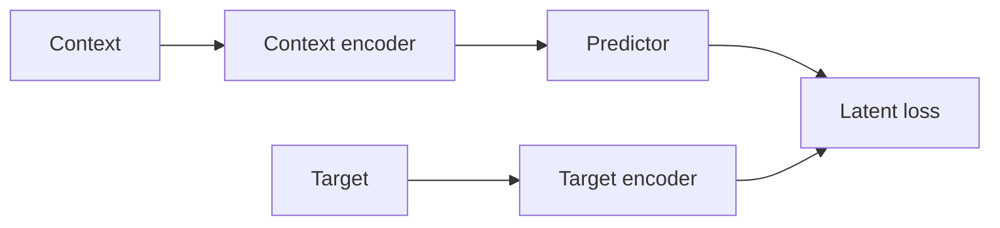

# Latent Prediction

## Core idea

Instead of reconstructing raw target content (pixels, tokens), a latent-prediction model predicts the *embedding* of the target, produced by a target encoder, from the embedding of the context, produced by a (possibly separate) context encoder:

`L = distance(Predictor(Encoder_context(context)), Encoder_target(target))`

The target encoder is typically an exponential moving average of the context encoder's weights, rather than a fully independent network, which stabilizes training by preventing the target representation from collapsing or drifting arbitrarily during joint optimization.

## Why predict in latent space instead of raw space

Raw reconstruction forces the model to spend capacity modeling every low-level detail of the target, including detail that is unpredictable given the context (exact pixel noise, exact word choice among synonyms). Latent prediction can ignore that unpredictable detail — a well-trained encoder maps such detail to similar or unstructured regions of latent space — and dedicate model capacity to abstract, predictable structure instead.

## Concrete instance: JEPA

JEPA-family models (I-JEPA, V-JEPA) mask part of an image or video, encode the visible context, encode the masked target region separately, and train a predictor to produce the target's latent representation from the context's latent representation — never reconstructing target pixels at all (see JEPA Family).

## Where this shows up

Latent prediction generalizes beyond JEPA: any self-supervised scheme that predicts a target representation rather than target content (some contrastive and self-distillation methods share this structure) fits this pattern. It is one particular answer to the "what must the intermediate representation preserve" design question raised in the Encoder and Decoder Pattern — namely, "predictable structure, not exact content."

[Back to index](../INDEX.md)
