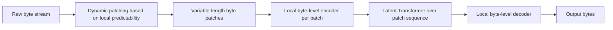

# Tokenizer-Free and Byte-Level Models

## The Problem

A fixed subword vocabulary fragments rare strings, code identifiers, and low-resource languages into many small pieces, each consuming a token slot. That wastes context budget and can hurt quality on exactly the inputs a fixed vocabulary was worst at compressing. Processing raw bytes instead removes the fixed vocabulary entirely, but naive byte-level modeling makes sequences much longer — every character becomes its own position, multiplying sequence length and therefore compute cost for any architecture with cost that grows with sequence length.

## The Byte Latent Transformer (BLT) Approach

BLT resolves this by making the unit of computation itself adaptive: instead of a fixed tokenizer producing fixed-size subword tokens, it dynamically groups bytes into variable-length patches, with patch boundaries determined by how predictable the next byte is. A run of highly predictable bytes (common substrings) is compressed into one large patch; a run of unpredictable bytes (rare or novel content) is split into smaller patches, giving the model more computation exactly where the input is harder to predict.

This means compute granularity is no longer a fixed property of a vocabulary decided before training — it is decided dynamically per input, based on local predictability. A local byte-level submodel handles the fine-grained byte structure inside each patch, while a larger latent Transformer operates over the sequence of patches, at a much shorter effective sequence length than raw bytes would require.

## Information Flow

## Why This Matters Architecturally

Removing the fixed tokenizer removes a whole class of failure modes tied to vocabulary choice: out-of-vocabulary fragmentation, unequal compression across languages, and brittle handling of code and unusual strings. The cost is that the architecture now needs an internal mechanism (the dynamic patching) to recover the compute-efficiency that a fixed tokenizer used to provide for free, and that mechanism itself has to be learned or heuristically tuned to actually allocate patches well.

## Open Questions

Whether dynamic byte/patch architectures will displace fixed subword tokenizers across the board, or remain a specialized choice for domains where tokenizer fragmentation is especially costly (code, low-resource languages, adversarial or noisy text), is not settled by public research as of this writing.

## References

- Pagnoni, A. et al. (2024). *Byte Latent Transformer: Patches Scale Better Than Tokens.* [arXiv:2412.09871](https://arxiv.org/abs/2412.09871).

[Back to index](../INDEX.md)
