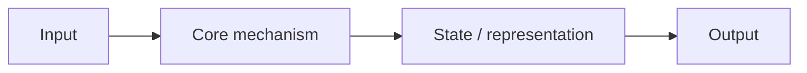

# <Architecture Name>

## One-Minute Explanation

Explain the idea in plain language first. Define specialized terms when they first appear, and state what the model can do because of this design.

## Problem It Tries to Solve

Describe the concrete limitation: for example, latency, memory, sequence length, data efficiency, controllability or the need to model a particular input type.

## Core Architectural Idea

Give the formal definition after the intuition. Include equations, assumptions and a small worked example when they clarify the mechanism.

## Information Flow

## Components

| Component | Role |
|---|---|
| | |

## Computational Characteristics

| Dimension | Notes |
|---|---|
| training parallelism | |
| sequence scaling | |
| total parameters | |
| active parameters | |
| persistent inference state | |
| communication | |

## Strengths
## Limitations and Failure Modes
## Architecture vs Training Objective
## When to Use It
## When Not to Use It

Name the constraints or failure modes that make another approach a better choice.

## Practical Applicability

| Use case | Why this architecture fits | Important constraint |
|---|---|---|
| | | |

Mention the workload, latency or memory target, deployment setting and the main metric to validate.
## Comparison with Alternatives
## Representative Models

List research examples first, then public commercial models or products that visibly use, expose or are strongly associated with this pattern. Label commercial examples as **publicly documented** or **inferred from published behavior**; do not present proprietary implementation details as fact.

## References
