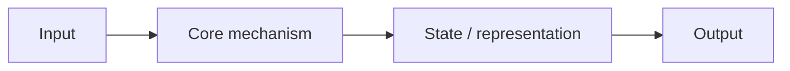

# <Architecture Name>

## Context and Plain-Language Explanation

Begin with the real-world context: what kind of input or task is involved, what limitation prompted this design, and where the architecture sits in a larger system. Then explain the idea in plain language before introducing equations or specialist vocabulary. Define each necessary term when it first appears, use a small concrete example, and state what the model can and cannot do because of this design.

## Why This Architecture Exists

In practical terms, **<Architecture Name>** is useful because it addresses a limitation that simpler approaches face. The next paragraph explains that limitation in technical detail; first, keep in mind the real-world goal: making the model more useful, efficient, reliable, or capable for a particular kind of task.

Start with the user-facing or engineering problem in ordinary language. Give a small concrete example before explaining the formal limitation—for example, why a model struggles with long inputs, repeated computation, memory use, data efficiency, controllability, or a particular input type. Introduce equations only after the reader understands what they are helping to express.

## Core Architectural Idea

Give the formal definition after the intuition. Include equations, assumptions and a small worked example when they clarify the mechanism.

## Information Flow

## Components

| Component | Role |
|---|---|
| | |

## Computational Characteristics

| Dimension | Notes |
|---|---|
| training parallelism | |
| sequence scaling | |
| total parameters | |
| active parameters | |
| persistent inference state | |
| communication | |

## Strengths
## Limitations and Failure Modes
## Architecture vs Training Objective
## When to Use It
## When Not to Use It

Name the constraints or failure modes that make another approach a better choice.

## Practical Applicability

| Use case | Why this architecture fits | Important constraint |
|---|---|---|
| | | |

Mention the workload, latency or memory target, deployment setting and the main metric to validate.
## Comparison with Alternatives
## Representative Models

List research examples first, then public commercial models or products that visibly use, expose or are strongly associated with this pattern. Label commercial examples as **publicly documented** or **inferred from published behavior**; do not present proprietary implementation details as fact.

## References
