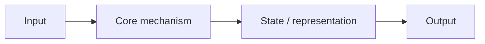

# <Architecture Name>

## One-Minute Explanation
## Problem It Tries to Solve
## Core Architectural Idea

## Information Flow

## Components

| Component | Role |
|---|---|
| | |

## Computational Characteristics

| Dimension | Notes |
|---|---|
| training parallelism | |
| sequence scaling | |
| total parameters | |
| active parameters | |
| persistent inference state | |
| communication | |

## Strengths
## Limitations and Failure Modes
## Architecture vs Training Objective
## When to Use It
## When Not to Use It
## Comparison with Alternatives
## Representative Models
## References
